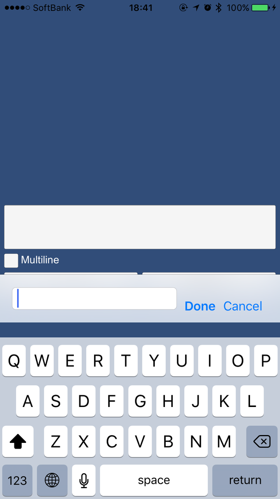
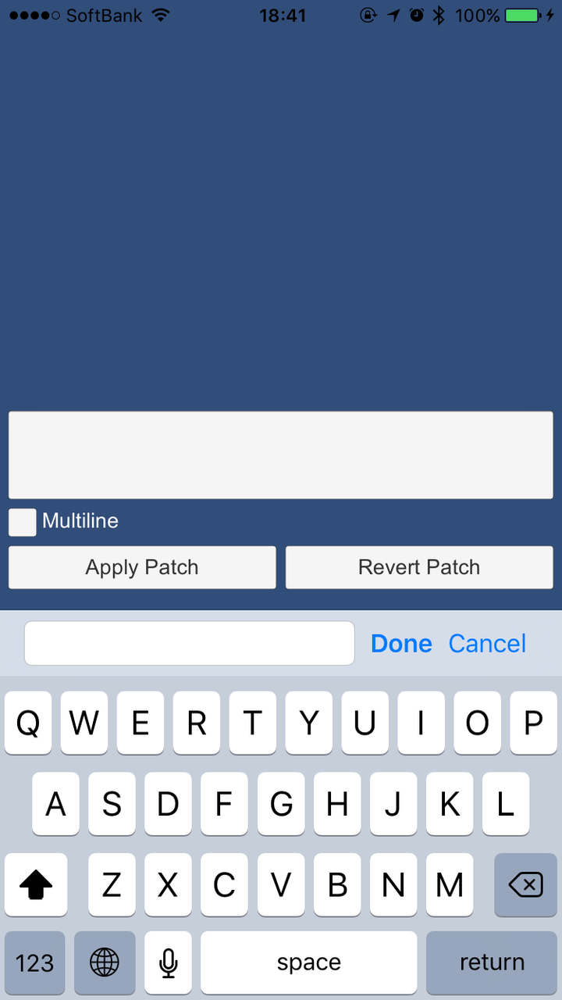

#Unity iOS Keyboard Patch

##Description

This patch adjusts the position of input field above keyboard when status bar is shown in iOS 7 or later. 




This patch is compatible with Unity versions below:

-	Unity 5.3.4f1
-	Unity 5.2.4f1

##Usage

Import iOSKeyboardPatch.unitypackage into your project. To apply this patch, call `iOSKeyboardPatch.Apply` method at the beginning of the scene. (at `Start` method etc.)

```
void Start() {
	iOSKeyboardPatch.Apply();
}
```